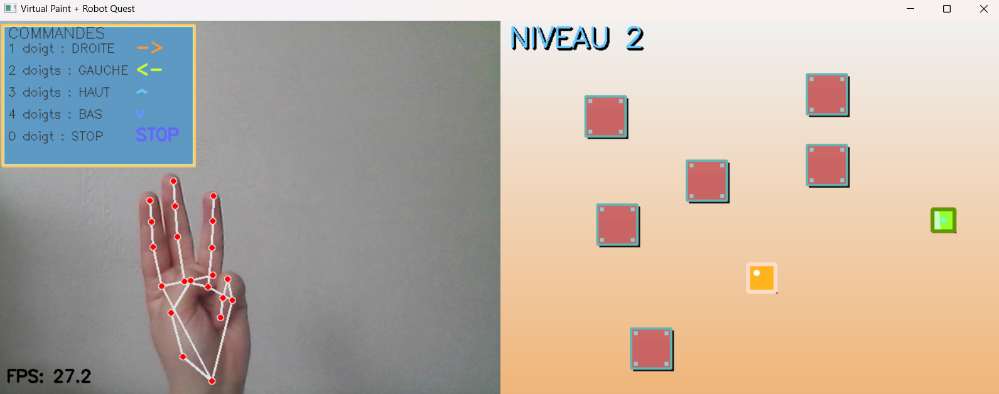

#  AirDraw – Dessin interactif par reconnaissance de gestes

AirDraw est une application Python qui permet de dessiner dans l’air en utilisant la reconnaissance de gestes de la main via la webcam.

##  Fonctionnalités

-  Détection des mouvements de la main en temps réel
-  Dessin interactif à l’écran
-  Utilisation de la webcam
-  Reconnaissance de gestes avec MediaPipe

---

##  Technologies utilisées

- Python
- OpenCV
- MediaPipe
- NumPy

---

##  Installation

1. Cloner le projet :

```bash
git clone https://github.com/islem-jnaieh/AirDraw-Gesture-Dessin-interactif-par-reconnaissance-de-gestes.git
```

2. Installer les dépendances :

```bash
pip install opencv-python mediapipe numpy
```

3. Lancer le programme :

```bash
python main.py
```

---

##  Comment utiliser ?

1. Lance l’application
2. Montre ta main devant la webcam
3. Utilise ton doigt pour dessiner dans l’air 

---

##  Aperçu



---

##  Auteur

Islem Jnaieh  
 islemjnaieh07@gmail.com  
 GitHub: https://github.com/islem-jnaieh

---

##  Si le projet te plaît

N’hésite pas à mettre une étoile  sur le repository !
